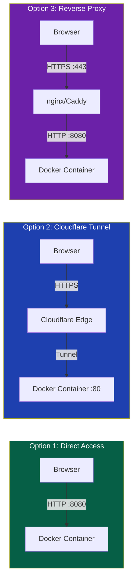
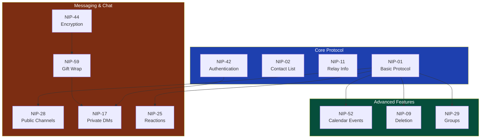
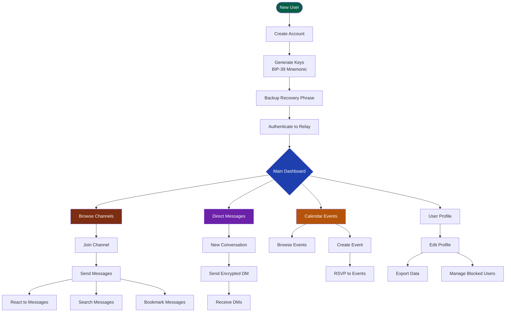
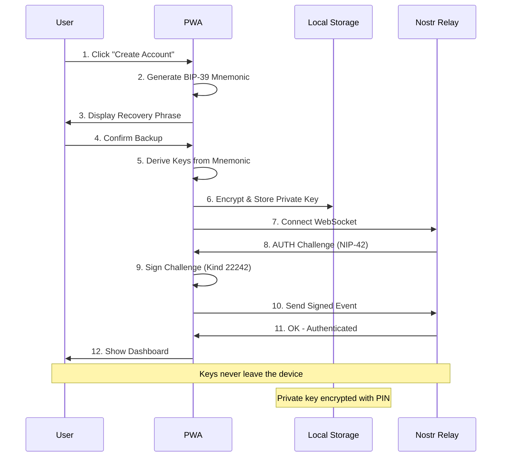
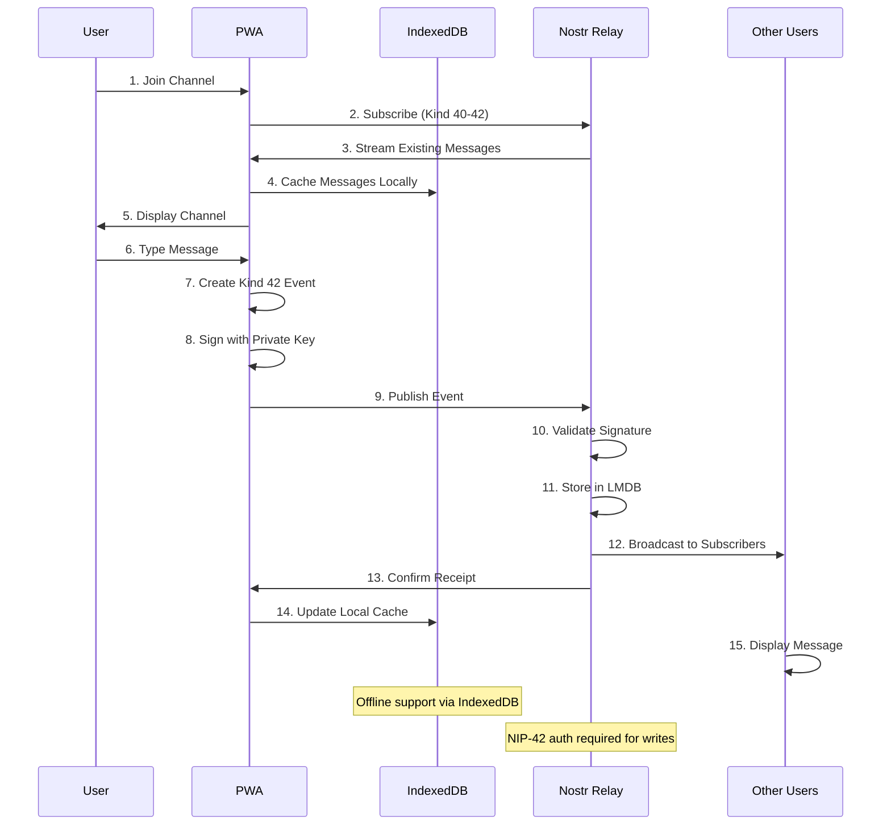
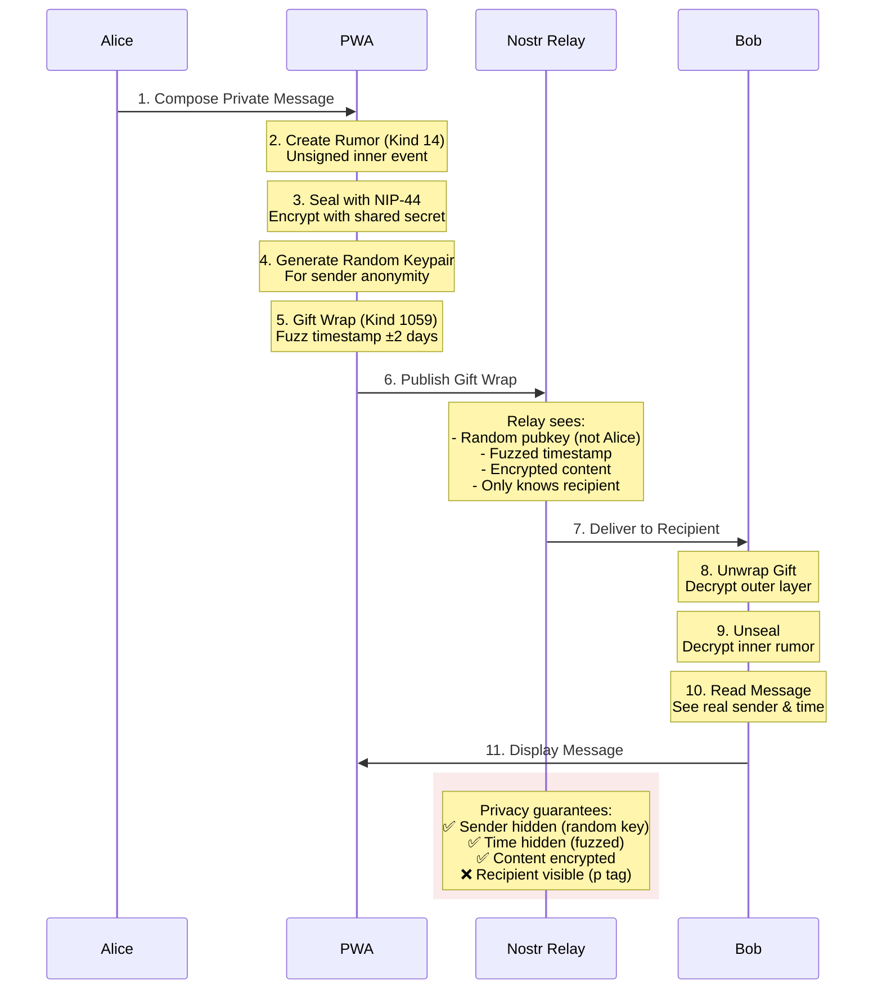
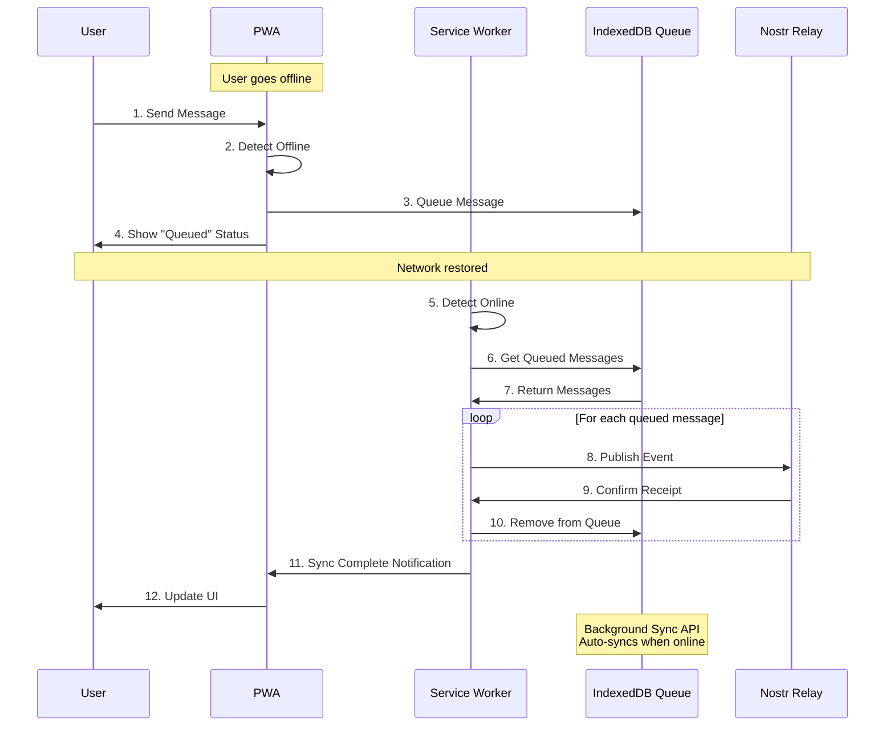

# Minimoonoir

A privacy-first community messaging platform built on the Nostr protocol. Features NIP-52 calendar events, NIP-28 public chat channels, NIP-17/59 encrypted direct messages, and a built-in strfry relay in a single Docker container.

[](LICENSE)
[](https://nostr.com)
[](https://kit.svelte.dev)
[](https://docker.com)

## Features

- **Public Chat Channels** - NIP-28 group messaging with admin-managed channels
- **Calendar Events** - NIP-52 event scheduling with RSVP support
- **Encrypted DMs** - NIP-17/59 gift-wrapped private messages
- **PWA Support** - Installable app with offline message queue
- **Single Container** - Website + strfry relay in one Docker image
- **Cloudflared Ready** - HTTP exposed for tunnel-based HTTPS termination

## Quick Start

### Docker Deployment (Recommended)

```bash
# Clone the repository
git clone https://github.com/your-username/minimoonoir.git
cd minimoonoir

# Build the PWA
npm install
npm run build

# Start services with Docker Compose
docker-compose up -d

# Access the application
# Website: http://localhost:8080
# Relay:   ws://localhost:8080/relay
```

### Local Development

```bash
# Install dependencies
npm install

# Start development server
npm run dev

# Build for production
npm run build

# Preview production build
npm run preview
```

## Architecture

### System Overview

```mermaid
graph TB
    subgraph Internet["Internet Access"]
        User["Web Browser"]
        Tunnel["Cloudflare Tunnel<br/>(Optional HTTPS)"]
    end

    subgraph Docker["Docker Container :8080"]
        subgraph Nginx["nginx :80"]
            Static["Static Files<br/>/var/www/html"]
            WSProxy["WebSocket Proxy<br/>/relay → :7777"]
        end

        subgraph Strfry["strfry :7777"]
            LMDB[(LMDB Database)]
            Auth["NIP-42 Auth Plugin"]
            Groups["NIP-29 Groups"]
        end

        Supervisor["supervisord<br/>(Process Manager)"]
    end

    User -->|HTTPS| Tunnel
    Tunnel -->|HTTP :80| Nginx
    User -.->|HTTP<br/>(local)| Nginx

    Static -->|SvelteKit SPA| User
    WSProxy <-->|WebSocket| Strfry
    Strfry --> LMDB
    Strfry --> Auth
    Strfry --> Groups

    Supervisor -->|manages| Nginx
    Supervisor -->|manages| Strfry

    style Docker fill:#1e3a8a,color:#fff
    style Internet fill:#064e3b,color:#fff
```

### Deployment Options



## Nostr Implementation

### Supported NIPs



### NIP Implementation Table

| NIP | Name | Status | Description |
|-----|------|--------|-------------|
| [NIP-01](https://github.com/nostr-protocol/nips/blob/master/01.md) | Basic Protocol | ✅ Complete | Core event format and relay communication |
| [NIP-02](https://github.com/nostr-protocol/nips/blob/master/02.md) | Contact List | ✅ Complete | Following list management |
| [NIP-09](https://github.com/nostr-protocol/nips/blob/master/09.md) | Event Deletion | ✅ Complete | Message deletion support |
| [NIP-11](https://github.com/nostr-protocol/nips/blob/master/11.md) | Relay Information | ✅ Complete | Relay metadata document |
| [NIP-17](https://github.com/nostr-protocol/nips/blob/master/17.md) | Private DMs | ✅ Complete | Sealed rumors for private messaging |
| [NIP-25](https://github.com/nostr-protocol/nips/blob/master/25.md) | Reactions | ✅ Complete | Message reactions (emoji) |
| [NIP-28](https://github.com/nostr-protocol/nips/blob/master/28.md) | Public Chat | ✅ Complete | Group channels with moderation |
| [NIP-29](https://github.com/nostr-protocol/nips/blob/master/29.md) | Groups | ✅ Complete | Relay-based groups with moderation |
| [NIP-42](https://github.com/nostr-protocol/nips/blob/master/42.md) | Authentication | ✅ Complete | Relay authentication challenges |
| [NIP-44](https://github.com/nostr-protocol/nips/blob/master/44.md) | Versioned Encryption | ✅ Complete | Modern encryption for DMs |
| [NIP-52](https://github.com/nostr-protocol/nips/blob/master/52.md) | Calendar Events | ✅ Complete | Event scheduling with RSVP |
| [NIP-59](https://github.com/nostr-protocol/nips/blob/master/59.md) | Gift Wrap | ✅ Complete | Metadata protection layer |

### Event Kinds

| Kind | NIP | Purpose | Documentation |
|------|-----|---------|---------------|
| 0 | 01 | User Profile | Metadata (name, avatar, bio) |
| 1 | 01 | Text Note | Channel messages |
| 4 | 04 | Encrypted DM | Legacy DMs (read-only) |
| 5 | 09 | Deletion | Delete own messages |
| 7 | 25 | Reaction | Emoji reactions |
| 9 | 29 | Group Chat | Group messages |
| 10 | 29 | Group Metadata | Group info |
| 11 | 29 | Group Admins | Admin list |
| 12 | 29 | Group Members | Member list |
| 40 | 28 | Channel Creation | Create channel |
| 41 | 28 | Channel Metadata | Update channel |
| 42 | 28 | Channel Message | Post to channel |
| 1059 | 59 | Gift Wrap | Wrapped DMs |
| 31923 | 52 | Calendar Event | Date-based events |
| 31925 | 52 | Calendar RSVP | Event responses |

## User Flows

### Complete User Journey



### Authentication Flow



### Channel Messaging Flow



### Gift-Wrapped DM Flow (NIP-17/59)



### Offline Message Queue Flow



## Project Structure

```
minimoonoir/
├── src/
│   ├── lib/
│   │   ├── components/      # Svelte components
│   │   │   ├── auth/        # Login, signup, profile
│   │   │   ├── chat/        # Channel list, messages
│   │   │   ├── dm/          # Direct messages
│   │   │   ├── events/      # Calendar, booking
│   │   │   ├── admin/       # Admin panel
│   │   │   ├── forum/       # Forum-style features
│   │   │   └── ui/          # Reusable UI components
│   │   ├── nostr/           # Nostr protocol implementation
│   │   │   ├── keys.ts      # BIP-39 key generation
│   │   │   ├── encryption.ts # NIP-44 encryption
│   │   │   ├── dm.ts        # NIP-17/59 DM functions
│   │   │   ├── channels.ts  # NIP-28 channels
│   │   │   ├── groups.ts    # NIP-29 groups
│   │   │   ├── reactions.ts # NIP-25 reactions
│   │   │   ├── calendar.ts  # NIP-52 events
│   │   │   └── relay.ts     # NDK relay manager
│   │   ├── stores/          # Svelte stores
│   │   │   ├── auth.ts      # Authentication state
│   │   │   ├── channels.ts  # Channel subscriptions
│   │   │   ├── messages.ts  # Message cache
│   │   │   ├── dm.ts        # DM conversations
│   │   │   ├── pwa.ts       # PWA state
│   │   │   ├── bookmarks.ts # Bookmarked messages
│   │   │   ├── drafts.ts    # Message drafts
│   │   │   └── mute.ts      # Blocked users
│   │   └── utils/           # Helper functions
│   │       ├── storage.ts   # IndexedDB operations
│   │       ├── crypto.ts    # Cryptographic utilities
│   │       ├── search.ts    # Message search
│   │       └── export.ts    # Data export
│   ├── routes/              # SvelteKit routes
│   │   ├── +page.svelte     # Landing page
│   │   ├── chat/            # Chat interface
│   │   ├── dm/              # Direct messages
│   │   ├── events/          # Calendar events
│   │   ├── admin/           # Admin dashboard
│   │   └── settings/        # User settings
│   └── service-worker.ts    # PWA service worker
├── relay/
│   ├── strfry.conf          # Relay configuration
│   ├── strfry-dev.conf      # Development config
│   └── whitelist.json       # Authorized pubkeys
├── static/                  # Static assets
│   ├── manifest.json        # PWA manifest
│   └── icon-*.png           # PWA icons
├── tests/                   # Test suites
│   ├── unit/                # Unit tests
│   └── e2e/                 # E2E tests
├── docs/                    # Documentation
│   ├── DEPLOYMENT.md        # Deployment guide
│   ├── SECURITY_AUDIT.md    # Security documentation
│   ├── dm-implementation.md # DM implementation
│   ├── pwa-implementation.md # PWA guide
│   └── sparc/               # SPARC methodology docs
├── Dockerfile               # Multi-stage Docker build
├── docker-compose.yml       # Deployment config
├── nginx.conf               # Web server config
└── package.json             # Node dependencies
```

## Configuration

### Environment Variables

```bash
# .env
VITE_RELAY_URL=ws://localhost:8080/relay    # Relay WebSocket URL
VITE_ADMIN_PUBKEY=<hex-pubkey>              # Admin public key (hex)
VITE_NDK_DEBUG=false                         # Enable NDK debug logging
```

### Relay Configuration

The strfry relay is configured in `relay/strfry.conf`:

```conf
relay {
    name = "Minimoonoir Private Relay"
    bind = "127.0.0.1"
    port = 7777
    noTLS = true
}

events {
    maxEventSize = 65536
    maxNumTags = 2000
}

negentropy {
    enabled = true
    maxSyncEvents = 1000000
}
```

## Docker Deployment

### Using Docker Compose

```bash
# Build and start
docker-compose up -d --build

# View logs
docker-compose logs -f

# Stop services
docker-compose down

# Rebuild after code changes
npm run build && docker-compose restart

# Access
# Website: http://localhost:8080
# Relay:   ws://localhost:8080/relay
```

### Endpoints

| Path | Service | Description |
|------|---------|-------------|
| `/` | nginx | PWA static files |
| `/relay` | strfry | Nostr WebSocket |
| `/relay/` | strfry | NIP-11 relay info (HTTP GET) |
| `/health` | nginx | Health check endpoint |

### With Cloudflare Tunnel

```bash
# Install cloudflared
curl -L https://github.com/cloudflare/cloudflared/releases/latest/download/cloudflared-linux-amd64 -o cloudflared
chmod +x cloudflared
sudo mv cloudflared /usr/local/bin/

# Create tunnel
cloudflared tunnel login
cloudflared tunnel create minimoonoir
cloudflared tunnel route dns minimoonoir chat.yourdomain.com

# Configure (~/.cloudflared/config.yml)
tunnel: <TUNNEL_ID>
credentials-file: /home/<user>/.cloudflared/<TUNNEL_ID>.json

ingress:
  - hostname: chat.yourdomain.com
    service: http://localhost:8080
  - service: http_status:404

# Run tunnel
cloudflared tunnel run minimoonoir
```

### With Reverse Proxy

```bash
# Caddy example
chat.example.com {
    reverse_proxy localhost:8080
}

# nginx example
server {
    listen 443 ssl http2;
    server_name chat.example.com;

    location / {
        proxy_pass http://localhost:8080;
        proxy_set_header Host $host;
        proxy_set_header X-Real-IP $remote_addr;
    }

    location /relay {
        proxy_pass http://localhost:8080/relay;
        proxy_http_version 1.1;
        proxy_set_header Upgrade $http_upgrade;
        proxy_set_header Connection "upgrade";
    }
}
```

## Testing

```bash
# Run all tests
npm test

# Run unit tests
npm test -- unit

# Run E2E tests with Playwright
npm run test:e2e

# Test specific file
npm test src/lib/nostr/dm.test.ts

# Run tests in watch mode
npm test -- --watch
```

## Security Considerations

### Key Management
- Private keys stored encrypted in localStorage
- BIP-39 mnemonic backup for key recovery
- Keys never transmitted to server or relay
- Optional PIN/passphrase protection

### Message Privacy
- NIP-44 encryption for all DMs
- Gift wrap hides sender identity from relay
- Timestamp fuzzing prevents timing analysis
- Content encrypted end-to-end

### Relay Security
- NIP-42 authentication required for writes
- Optional whitelist for private communities
- Rate limiting and event validation
- NIP-09 deletion support

### Network Security
- HTTPS required in production (via Cloudflare Tunnel or reverse proxy)
- WebSocket Secure (WSS) for relay connections
- Content Security Policy headers
- CORS configuration

## GitHub Labels

Our project uses a comprehensive labeling system for issue and PR management:

### Priority Labels
- `priority: critical` 🔴 - Security issues, data loss bugs, service outages
- `priority: high` 🟠 - Major features, significant bugs affecting many users
- `priority: medium` 🟡 - Regular features, moderate bugs
- `priority: low` 🟢 - Nice-to-have features, minor improvements

### Type Labels
- `type: bug` 🐛 - Something isn't working
- `type: feature` ✨ - New feature request
- `type: enhancement` 🚀 - Improvement to existing feature
- `type: documentation` 📚 - Documentation improvements
- `type: refactor` 🔧 - Code refactoring
- `type: test` 🧪 - Test-related changes
- `type: security` 🔒 - Security-related issues

### Area Labels
- `area: relay` 📡 - Strfry relay, NIP implementation
- `area: pwa` 📱 - Progressive Web App, service worker
- `area: ui/ux` 🎨 - User interface and experience
- `area: encryption` 🔐 - NIP-44, NIP-17/59 encryption
- `area: channels` 💬 - NIP-28 public channels
- `area: dm` 📨 - Direct messaging (NIP-17/59)
- `area: calendar` 📅 - NIP-52 calendar events
- `area: admin` 👑 - Admin panel and moderation
- `area: deployment` 🚢 - Docker, deployment, infrastructure

### Status Labels
- `status: needs triage` 🏷️ - Needs review and classification
- `status: blocked` 🚫 - Blocked by dependencies
- `status: in progress` 🔄 - Currently being worked on
- `status: needs review` 👀 - Awaiting code review
- `status: ready to merge` ✅ - Approved and ready

### Special Labels
- `good first issue` 🌱 - Good for newcomers
- `help wanted` 🆘 - Extra attention needed
- `breaking change` ⚠️ - Breaking API changes
- `dependencies` 📦 - Dependency updates

## API Reference

### Relay Manager

```typescript
import { connectRelay, publishEvent, subscribe } from '$lib/nostr';

// Connect to relay
await connectRelay('ws://localhost:8080/relay', privateKey);

// Publish event
const event = new NDKEvent();
event.kind = 1;
event.content = 'Hello Nostr!';
await publishEvent(event);

// Subscribe to events
const sub = subscribe({ kinds: [1], limit: 10 });
sub.on('event', (event) => console.log(event));
```

### Direct Messages

```typescript
import { sendDM, receiveDM, createDMFilter } from '$lib/nostr/dm';

// Send encrypted DM
await sendDM('Hello!', recipientPubkey, senderPrivkey, relay);

// Receive and decrypt
const dm = receiveDM(giftWrapEvent, myPrivkey);
console.log(dm.content, dm.senderPubkey);

// Subscribe to DMs
const filter = createDMFilter(myPubkey);
```

### Channel Operations

```typescript
import { createChannel, sendChannelMessage } from '$lib/nostr/channels';

// Create channel (admin only)
await createChannel({
  name: 'General',
  about: 'General discussion',
  picture: 'https://example.com/icon.png'
});

// Send message
await sendChannelMessage(channelId, 'Hello channel!');
```

## Documentation

### User Guides
- [Deployment Guide](docs/DEPLOYMENT.md) - Docker deployment and configuration
- [Security Audit](docs/SECURITY_AUDIT.md) - Security analysis and recommendations
- [PWA Implementation](docs/pwa-implementation.md) - Offline support and installation
- [DM Implementation](docs/dm-implementation.md) - NIP-17/59 encrypted messaging

### Feature Documentation
- [Calendar Events](docs/events-module-example.md) - NIP-52 calendar implementation
- [Message Threading](docs/threading-implementation.md) - Threaded conversations
- [Reactions](docs/nip-25-reactions-implementation.md) - NIP-25 emoji reactions
- [Search](docs/search-implementation.md) - Global message search
- [Mute & Block](docs/mute-implementation-summary.md) - User blocking system
- [Pinned Messages](docs/pinned-messages-implementation.md) - Pin important messages
- [Link Previews](docs/link-preview-implementation.md) - URL preview generation
- [Drafts](docs/drafts-implementation.md) - Message draft persistence
- [Export](docs/export-implementation.md) - Data export functionality

### Architecture Documentation
- [System Architecture](docs/sparc/02-architecture.md) - System design details
- [Specification](docs/sparc/01-specification.md) - Requirements and specs
- [Pseudocode](docs/sparc/03-pseudocode.md) - Algorithm design
- [Refinement](docs/sparc/04-refinement.md) - Implementation refinement
- [Completion](docs/sparc/05-completion.md) - Integration and deployment

## Contributing

1. Fork the repository
2. Create your feature branch (`git checkout -b feature/amazing-feature`)
3. Commit your changes (`git commit -m 'Add amazing feature'`)
4. Push to the branch (`git push origin feature/amazing-feature`)
5. Open a Pull Request

### Development Guidelines

- Follow the existing code style
- Write tests for new features
- Update documentation as needed
- Use semantic commit messages
- Ensure all tests pass before submitting PR

## License

MIT License - see [LICENSE](LICENSE) for details.

## Acknowledgments

- [Nostr Protocol](https://nostr.com) - The protocol specification
- [NDK](https://github.com/nostr-dev-kit/ndk) - Nostr Development Kit
- [strfry](https://github.com/hoytech/strfry) - High-performance Nostr relay
- [SvelteKit](https://kit.svelte.dev) - Web application framework
- [Tailwind CSS](https://tailwindcss.com) - Utility-first CSS framework

## Support

- Documentation: See [docs/](docs/) directory
- Issues: [GitHub Issues](https://github.com/your-username/minimoonoir/issues)
- Discussions: [GitHub Discussions](https://github.com/your-username/minimoonoir/discussions)
