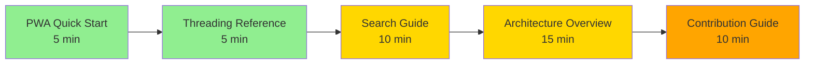
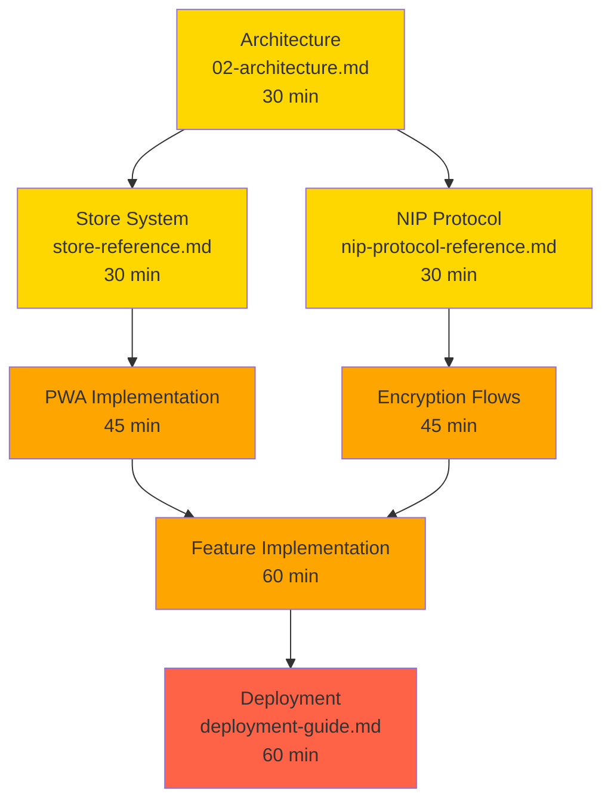
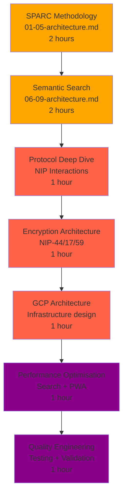

# Navigation Design Specification

**Documentation Navigation System Design**
**Project:** Nostr-BBS
**Version:** 1.0.0
**Date:** 2025-12-23

---

## Executive Summary

This specification defines **7 role-based navigation paths**, **3 learning progressions**, and a comprehensive wayfinding system for the Nostr-BBS documentation corpus (79 files, 859 internal links).

### Key Deliverables

1. **7+ Navigation Paths** - Role-specific documentation journeys
2. **Role-Based Entry Points** - Optimised landing pages for User/Developer/DevOps
3. **Learning Paths** - Progressive difficulty levels (Beginner → Advanced)
4. **Breadcrumb System** - Contextual navigation with depth awareness
5. **Sidebar Organisation** - Hierarchical menu structure recommendations

---

## Table of Contents

- [1. Navigation Paths (7 Roles)](#1-navigation-paths-7-roles)
- [2. Role-Based Entry Points](#2-role-based-entry-points)
- [3. Learning Path Progressions](#3-learning-path-progressions)
- [4. Breadcrumb Navigation Structure](#4-breadcrumb-navigation-structure)
- [5. Sidebar/Menu Organisation](#5-sidebarmenu-organisation)
- [6. Implementation Recommendations](#6-implementation-recommendations)

---

## 1. Navigation Paths (7 Roles)

### 1.1 End User Path (Beginner)

**Goal:** Start using Nostr-BBS quickly without technical knowledge

**Journey:**
```
INDEX.md (Getting Started section)
  ↓
PWA Quick Start (5 min read)
  ↓
Threading Quick Reference
  ↓
Search Usage Guide
  ↓
Mute Quick Reference
  ↓
Channel Stats Usage
```

**Characteristics:**
- **Duration:** 15-20 minutes total
- **Difficulty:** Beginner
- **Format:** Tutorials and quick references
- **Prerequisites:** None

**Entry Point:** `docs/INDEX.md#getting-started`

**Exit Criteria:** User can install app, send messages, search, and manage privacy

---

### 1.2 Frontend Developer Path

**Goal:** Understand Svelte frontend architecture and contribute code

**Journey:**
```
INDEX.md (Architecture section)
  ↓
02-Architecture.md (Frontend components)
  ↓
Store Reference (State management)
  ↓
Store Dependency Analysis
  ↓
PWA Implementation
  ↓
API Reference
  ↓
Threading Implementation
  ↓
Search Implementation
```

**Characteristics:**
- **Duration:** 2-3 hours
- **Difficulty:** Intermediate
- **Format:** Explanation → Reference → How-to
- **Prerequisites:** Svelte, TypeScript knowledge

**Entry Point:** `docs/architecture/02-architecture.md#frontend-architecture`

**Exit Criteria:** Developer can create components, manage stores, understand PWA lifecycle

---

### 1.3 Backend/Protocol Developer Path

**Goal:** Implement Nostr protocol features and relay integration

**Journey:**
```
INDEX.md (Architecture section)
  ↓
NIP Protocol Reference
  ↓
NIP Interactions (Protocol architecture)
  ↓
Encryption Flows (NIP-44, NIP-17/59)
  ↓
02-Architecture.md (Relay layer)
  ↓
DM Implementation (NIP-17/59 example)
  ↓
Threading Implementation (NIP-10 example)
  ↓
API Reference
```

**Characteristics:**
- **Duration:** 3-4 hours
- **Difficulty:** Advanced
- **Format:** Reference → Explanation → Implementation
- **Prerequisites:** Nostr protocol, WebSocket, cryptography

**Entry Point:** `docs/reference/nip-protocol-reference.md`

**Exit Criteria:** Developer can implement NIPs, handle encryption, integrate relay features

---

### 1.4 DevOps/Deployment Engineer Path

**Goal:** Deploy and maintain Nostr-BBS in production

**Journey:**
```
INDEX.md (Deployment section)
  ↓
Deployment Guide (Overview)
  ↓
GCP Architecture (Infrastructure design)
  ↓
GCP Deployment (Step-by-step)
  ↓
GitHub Workflows (CI/CD)
  ↓
Configuration Reference
  ↓
MAINTENANCE.md
```

**Characteristics:**
- **Duration:** 4-6 hours (includes hands-on)
- **Difficulty:** Intermediate
- **Format:** Tutorial → How-to → Reference
- **Prerequisites:** GCP, Docker, GitHub Actions

**Entry Point:** `docs/deployment/deployment-guide.md`

**Exit Criteria:** Can deploy to GCP, configure CI/CD, maintain production instance

---

### 1.5 QA/Testing Engineer Path

**Goal:** Validate features, test integrations, ensure quality

**Journey:**
```
INDEX.md (Architecture + Features)
  ↓
01-Specification.md (Requirements)
  ↓
05-Completion.md (Testing procedures)
  ↓
PWA Implementation (Test scenarios)
  ↓
Search Implementation (Test coverage)
  ↓
Link Validation Summary
  ↓
Final Quality Report
```

**Characteristics:**
- **Duration:** 2-3 hours
- **Difficulty:** Intermediate
- **Format:** Specification → How-to → Reference
- **Prerequisites:** Testing methodologies, QA processes

**Entry Point:** `docs/architecture/05-completion.md#testing`

**Exit Criteria:** Can write test plans, validate features, run quality checks

---

### 1.6 Technical Writer/Documentation Path

**Goal:** Contribute to documentation, maintain quality standards

**Journey:**
```
INDEX.md (Documentation Standards section)
  ↓
CONTRIBUTION.md
  ↓
IA Architecture Spec
  ↓
Tag Vocabulary
  ↓
Link Infrastructure Spec
  ↓
Metadata Implementation Report
  ↓
Diagram Audit Report
  ↓
Structure Normalisation Report
```

**Characteristics:**
- **Duration:** 2-3 hours
- **Difficulty:** Intermediate
- **Format:** Reference → How-to
- **Prerequisites:** Markdown, Diataxis, technical writing

**Entry Point:** `docs/CONTRIBUTION.md#documentation`

**Exit Criteria:** Can write documentation following Diataxis, add metadata, validate links

---

### 1.7 Open Source Contributor Path

**Goal:** Make first contribution (code or docs)

**Journey:**
```
README.md (Project overview)
  ↓
INDEX.md (Architecture overview)
  ↓
CONTRIBUTION.md
  ↓
[Choose one specialisation:]
  - Frontend: Store Reference → PWA Implementation
  - Backend: NIP Protocol Reference → DM Implementation
  - Docs: IA Architecture Spec → Link Validation Summary
  ↓
GitHub Issues (Find "good first issue")
  ↓
MAINTENANCE.md (After first PR merged)
```

**Characteristics:**
- **Duration:** 1-2 hours (overview), then specialise
- **Difficulty:** Beginner → Intermediate
- **Format:** Tutorial → How-to
- **Prerequisites:** Git, GitHub

**Entry Point:** `README.md` → `docs/CONTRIBUTION.md`

**Exit Criteria:** Understand project, made first PR, knows where to contribute

---

## 2. Role-Based Entry Points

### 2.1 User Entry Point (Non-Technical)

**Landing Page:** `docs/USER-GUIDE.md` (NEW FILE - to be created)

**Content Structure:**
```markdown
# Nostr-BBS User Guide

## Quick Start (5 minutes)
- [Install as PWA](features/pwa-quick-start.md)
- [Send your first message](features/threading-quick-reference.md#basic-usage)
- [Search for content](features/search-usage-guide.md#quick-start)

## Essential Features
- Threading and conversations
- Direct messages
- Muting and privacy
- Channel statistics

## FAQ
- What is Nostr?
- How do I backup my account?
- How do I join a channel?

[Full feature list →](INDEX.md#features)
```

**Navigation Characteristics:**
- Large buttons with icons
- "Next steps" suggestions
- Related quick references
- Minimal technical jargon

---

### 2.2 Developer Entry Point

**Landing Page:** `docs/DEVELOPER-GUIDE.md` (NEW FILE - to be created)

**Content Structure:**
```markdown
# Nostr-BBS Developer Guide

## Get Started
- [Architecture Overview](architecture/02-architecture.md)
- [API Reference](reference/api-reference.md)
- [Store System](reference/store-reference.md)

## By Technology
- **Frontend:** Svelte components, PWA, UI/UX
- **Protocol:** NIPs, encryption, relay integration
- **Backend:** Cloud services, deployment

## By Task
- Adding a new feature
- Implementing a NIP
- Improving performance
- Writing tests

[Contributing →](CONTRIBUTION.md)
```

**Navigation Characteristics:**
- Technical depth from start
- Code examples visible
- Architecture diagrams
- API-first presentation

---

### 2.3 DevOps Entry Point

**Landing Page:** `docs/DEVOPS-GUIDE.md` (NEW FILE - to be created)

**Content Structure:**
```markdown
# Nostr-BBS DevOps Guide

## Quick Deploy (30 minutes)
1. [GCP Setup](deployment/gcp-deployment.md#prerequisites)
2. [Configure secrets](reference/configuration-reference.md)
3. [Deploy Cloud Run](deployment/gcp-deployment.md#cloud-run)
4. [Setup CI/CD](deployment/github-workflows.md)

## Infrastructure
- [GCP Architecture](deployment/gcp-architecture.md)
- [Serverless design](architecture/02-architecture.md#cloud-services)
- [Configuration reference](reference/configuration-reference.md)

## Operations
- [Maintenance procedures](MAINTENANCE.md)
- [Monitoring and logs](deployment/gcp-deployment.md#monitoring)
- [Backup and recovery](deployment/gcp-deployment.md#backup)

[Deployment guide →](deployment/deployment-guide.md)
```

**Navigation Characteristics:**
- Step-by-step checklists
- Infrastructure diagrams
- Configuration examples
- Runbook format

---

## 3. Learning Path Progressions

### 3.1 Beginner Learning Path

**Target:** New users and junior developers

**Progression:**



**Difficulty Progression:**
1. **Green (Easy):** Quick references, UI guides - 5-10 min each
2. **Yellow (Medium):** Implementation guides, architecture - 15-30 min each
3. **Orange (Hard):** Protocol specs, deployment - 30-60 min each

**Total Time:** 45 minutes (basics) → 2 hours (comprehensive)

**Documents (Ordered):**
1. `features/pwa-quick-start.md` - ⏱️ 5 min - 🟢 Easy
2. `features/threading-quick-reference.md` - ⏱️ 5 min - 🟢 Easy
3. `features/search-usage-guide.md` - ⏱️ 10 min - 🟢 Easy
4. `features/mute-quick-reference.md` - ⏱️ 5 min - 🟢 Easy
5. `architecture/02-architecture.md` - ⏱️ 15 min - 🟡 Medium
6. `CONTRIBUTION.md` - ⏱️ 10 min - 🟡 Medium

**Exit Criteria:**
- Can use all major features
- Understand basic architecture
- Ready to contribute simple fixes

---

### 3.2 Intermediate Learning Path

**Target:** Experienced developers new to project

**Progression:**



**Difficulty Progression:**
1. **Yellow (Medium):** Architecture, references - 30 min each
2. **Orange (Hard):** Implementations, protocols - 45-60 min each
3. **Red (Advanced):** Deployment, integration - 60+ min each

**Total Time:** 4-6 hours

**Documents (Ordered by dependency):**
1. `architecture/02-architecture.md` - ⏱️ 30 min - 🟡 Medium
2. `reference/store-reference.md` - ⏱️ 30 min - 🟡 Medium
3. `reference/nip-protocol-reference.md` - ⏱️ 30 min - 🟡 Medium
4. `store-dependency-analysis.md` - ⏱️ 30 min - 🟡 Medium
5. `features/pwa-implementation.md` - ⏱️ 45 min - 🟠 Hard
6. `architecture/encryption-flows.md` - ⏱️ 45 min - 🟠 Hard
7. `features/search-implementation.md` - ⏱️ 60 min - 🟠 Hard
8. `deployment/deployment-guide.md` - ⏱️ 60 min - 🔴 Advanced

**Exit Criteria:**
- Can implement new features
- Understand protocol layer
- Can deploy to production

---

### 3.3 Advanced Learning Path

**Target:** Senior engineers and architects

**Progression:**



**Difficulty Progression:**
1. **Orange (Hard):** SPARC docs, semantic search - 60-120 min each
2. **Red (Advanced):** Protocol internals, architecture - 60 min each
3. **Purple (Expert):** Optimisation, quality engineering - 60+ min each

**Total Time:** 8-10 hours

**Documents (Ordered):**
1. `architecture/01-specification.md` - ⏱️ 30 min - 🟠 Hard
2. `architecture/02-architecture.md` - ⏱️ 30 min - 🟠 Hard
3. `architecture/03-pseudocode.md` - ⏱️ 30 min - 🟠 Hard
4. `architecture/04-refinement.md` - ⏱️ 30 min - 🟠 Hard
5. `architecture/05-completion.md` - ⏱️ 30 min - 🟠 Hard
6. `architecture/06-semantic-search-spec.md` - ⏱️ 30 min - 🟠 Hard
7. `architecture/07-semantic-search-architecture.md` - ⏱️ 45 min - 🟠 Hard
8. `architecture/08-semantic-search-pseudocode.md` - ⏱️ 45 min - 🔴 Advanced
9. `architecture/09-semantic-search-risks.md` - ⏱️ 30 min - 🔴 Advanced
10. `architecture/nip-interactions.md` - ⏱️ 60 min - 🔴 Advanced
11. `architecture/encryption-flows.md` - ⏱️ 60 min - 🔴 Advanced
12. `deployment/gcp-architecture.md` - ⏱️ 60 min - 🔴 Advanced
13. `features/search-implementation.md` - ⏱️ 60 min - 🟣 Expert
14. `working/final-quality-report.md` - ⏱️ 60 min - 🟣 Expert

**Exit Criteria:**
- Can architect new subsystems
- Can optimise performance
- Can lead technical decisions

---

## 4. Breadcrumb Navigation Structure

### 4.1 Breadcrumb Pattern Design

**Format:**
```
Home > Category > Subcategory > Current Page
```

**Example Breadcrumbs:**

```
# Architecture document
Home > Architecture > SPARC Methodology > 02 - Architecture

# Feature document
Home > Features > Messaging > DM Implementation

# Reference document
Home > Reference > API > Store Reference

# Deployment document
Home > Deployment > GCP > Architecture
```

### 4.2 Implementation Specification

**HTML Structure:**
```html
<nav aria-label="Breadcrumb" class="breadcrumb">
  <ol>
    <li><a href="/docs/INDEX.md">Home</a></li>
    <li><a href="/docs/architecture/">Architecture</a></li>
    <li><a href="/docs/architecture/#sparc-methodology">SPARC Methodology</a></li>
    <li aria-current="page">02 - Architecture</li>
  </ol>
</nav>
```

**Styling Guidelines:**
- Separator: `>` or `/` (consistent throughout)
- Current page: **bold**, no link
- Parent pages: linked, interactive
- Mobile: Collapse to `... > Parent > Current`

### 4.3 Breadcrumb Rules by Directory

| Directory | Breadcrumb Pattern | Example |
|-----------|-------------------|---------|
| `/docs/architecture/` | Home > Architecture > [SPARC Phase] > [Document] | Home > Architecture > SPARC > 02-Architecture |
| `/docs/features/` | Home > Features > [Category] > [Document] | Home > Features > Messaging > DM Implementation |
| `/docs/reference/` | Home > Reference > [Type] > [Document] | Home > Reference > API > Store Reference |
| `/docs/deployment/` | Home > Deployment > [Platform] > [Document] | Home > Deployment > GCP > Deployment Guide |
| `/docs/development/` | Home > Development > [Topic] > [Document] | Home > Development > Mentions > Patch Guide |
| `/docs/working/` | Home > Quality > [Process] > [Document] | Home > Quality > Validation > Link Report |

### 4.4 Contextual "You Are Here" Indicators

**Sidebar Enhancement:**
```markdown
📍 **You Are Here**
Home > Architecture > SPARC > 02-Architecture

**Related in this section:**
- [← Previous: 01-Specification](01-specification.md)
- [→ Next: 03-Pseudocode](03-pseudocode.md)

**In Architecture:**
- SPARC Methodology (5 docs)
- Semantic Search (4 docs)
- Protocol Design (2 docs)
```

---

## 5. Sidebar/Menu Organisation

### 5.1 Recommended Sidebar Structure

```
📚 Nostr-BBS Documentation
│
├── 🚀 Getting Started
│   ├── PWA Quick Start ⏱️ 5 min
│   ├── Threading Quick Reference ⏱️ 5 min
│   ├── Search Usage Guide ⏱️ 10 min
│   └── Mute Quick Reference ⏱️ 5 min
│
├── 🏗️ Architecture
│   ├── 📋 SPARC Methodology
│   │   ├── 01 - Specification
│   │   ├── 02 - Architecture ⭐ POPULAR
│   │   ├── 03 - Pseudocode
│   │   ├── 04 - Refinement
│   │   └── 05 - Completion
│   ├── 🔍 Semantic Search
│   │   ├── 06 - Search Specification
│   │   ├── 07 - Search Architecture
│   │   ├── 08 - Search Pseudocode
│   │   └── 09 - Search Risks
│   └── 🔐 Protocol Design
│       ├── NIP Interactions
│       └── Encryption Flows
│
├── ✨ Features
│   ├── 💬 Messaging
│   │   ├── Direct Messages ⭐ POPULAR
│   │   ├── Threading
│   │   └── Reactions (NIP-25)
│   ├── 🔍 Search & Discovery
│   │   ├── Search Implementation
│   │   ├── Search Summary
│   │   └── Link Previews
│   ├── 📱 Progressive Web App
│   │   ├── PWA Implementation ⭐ POPULAR
│   │   ├── Notifications
│   │   └── Offline Support
│   ├── 📝 Content Management
│   │   ├── Drafts
│   │   ├── Export
│   │   └── Pinned Messages
│   └── ♿ Accessibility
│       └── WCAG Improvements
│
├── 🔧 Development
│   ├── 📖 Developer Guide (NEW)
│   ├── 🏪 Store Architecture
│   │   ├── Store Reference ⭐ POPULAR
│   │   └── Store Dependency Analysis
│   └── 🛠️ Implementation Guides
│       └── Mentions Patch
│
├── 🚢 Deployment
│   ├── 📖 DevOps Guide (NEW)
│   ├── 🌐 GCP Deployment
│   │   ├── Deployment Guide ⭐ POPULAR
│   │   ├── GCP Deployment Steps
│   │   ├── GCP Architecture
│   │   └── Configuration Reference
│   └── ⚙️ CI/CD
│       └── GitHub Workflows
│
├── 📚 Reference
│   ├── API Reference ⭐ POPULAR
│   ├── Store Reference
│   ├── NIP Protocol Reference
│   └── Configuration Reference
│
├── 🤝 Contributing
│   ├── Contribution Guide
│   └── Maintenance Guide
│
└── 📊 Quality & Reports
    ├── Link Validation
    ├── Diagram Audit
    └── Final Quality Report

────────────────────────────────────
Legend:
⏱️ = Reading time estimate
⭐ = Popular/High-traffic document
🟢 = Beginner difficulty
🟡 = Intermediate difficulty
🟠 = Advanced difficulty
```

### 5.2 Collapsible Sections

**Default State (First Visit):**
- ✅ **Expanded:** Getting Started, Architecture (SPARC only)
- ⬜ **Collapsed:** Features, Development, Deployment, Reference, Quality

**User Preference:**
- Remember expanded/collapsed state via `localStorage`
- "Expand All" / "Collapse All" buttons at top

### 5.3 Navigation Metadata

**Add to each document's frontmatter:**
```yaml
---
title: PWA Implementation
sidebar_label: Progressive Web App  # Shorter label for sidebar
sidebar_position: 3  # Order within section
reading_time: 45  # Minutes
difficulty: intermediate  # beginner|intermediate|advanced|expert
popular: true  # Show ⭐ badge
related_docs:
  - features/pwa-quick-start.md
  - architecture/02-architecture.md
---
```

### 5.4 Search Integration in Sidebar

**Sidebar Header:**
```
┌─────────────────────────────────┐
│ 🔍 Search docs...               │
├─────────────────────────────────┤
│ 📚 Nostr-BBS Documentation      │
│   ↓                             │
│   🚀 Getting Started            │
│   🏗️ Architecture               │
│   ...                           │
└─────────────────────────────────┘
```

**Search Features:**
- Full-text search across all docs
- Filter by category (Architecture, Features, etc.)
- Show breadcrumb in results
- Highlight matching text

---

## 6. Implementation Recommendations

### 6.1 Priority 1: Create Entry Point Documents

**Files to Create:**

1. **`docs/USER-GUIDE.md`**
   - Audience: Non-technical users
   - Content: Quick start, essential features, FAQ
   - Links: Quick references, tutorials
   - Time to implement: 2 hours

2. **`docs/DEVELOPER-GUIDE.md`**
   - Audience: Software engineers
   - Content: Architecture, API, implementation guides
   - Links: Technical references, code examples
   - Time to implement: 3 hours

3. **`docs/DEVOPS-GUIDE.md`**
   - Audience: DevOps/SRE engineers
   - Content: Deployment, operations, monitoring
   - Links: Deployment guides, configuration
   - Time to implement: 2 hours

**Implementation Order:**
1. DEVELOPER-GUIDE.md (most urgent - highest traffic)
2. USER-GUIDE.md (second - onboarding)
3. DEVOPS-GUIDE.md (third - operational)

### 6.2 Priority 2: Add Navigation Metadata

**Update all 79 documents with:**

```yaml
---
sidebar_label: "Short Label"
sidebar_position: 1
reading_time: 30
difficulty: intermediate
breadcrumb:
  - Home
  - Architecture
  - SPARC
related_docs:
  - ../reference/api-reference.md
  - ./03-pseudocode.md
next_doc: ./03-pseudocode.md
prev_doc: ./01-specification.md
---
```

**Automation Script:**
```bash
#!/bin/bash
# scripts/add-navigation-metadata.sh
# Add navigation metadata to all docs
for file in docs/**/*.md; do
  # Extract category from path
  # Add frontmatter
  # Update reading time
done
```

**Time to implement:** 4 hours (with script)

### 6.3 Priority 3: Implement Breadcrumbs

**Add to each document (after frontmatter):**

```markdown
---
title: Store Reference
breadcrumb:
  - Home
  - Reference
  - API
---

<nav aria-label="Breadcrumb">
  <a href="../INDEX.md">Home</a> >
  <a href="../reference/">Reference</a> >
  <a href="./">API</a> >
  <strong>Store Reference</strong>
</nav>

# Store Reference

...
```

**Automation:**
- Generate breadcrumbs from `breadcrumb` metadata
- Use build-time script (e.g., `scripts/generate-breadcrumbs.js`)

**Time to implement:** 3 hours

### 6.4 Priority 4: Sidebar Implementation

**Technology Options:**

**Option A: VitePress (Recommended)**
```javascript
// .vitepress/config.js
export default {
  themeConfig: {
    sidebar: {
      '/': [
        {
          text: '🚀 Getting Started',
          collapsible: true,
          items: [
            { text: 'PWA Quick Start', link: '/features/pwa-quick-start' },
            { text: 'Threading', link: '/features/threading-quick-reference' }
          ]
        },
        {
          text: '🏗️ Architecture',
          collapsible: true,
          collapsed: true,
          items: [
            {
              text: 'SPARC Methodology',
              items: [
                { text: '01 - Specification', link: '/architecture/01-specification' },
                { text: '02 - Architecture', link: '/architecture/02-architecture' }
              ]
            }
          ]
        }
      ]
    }
  }
}
```

**Option B: Docusaurus**
```javascript
// sidebars.js
module.exports = {
  docs: [
    {
      type: 'category',
      label: '🚀 Getting Started',
      items: ['features/pwa-quick-start', 'features/threading-quick-reference']
    },
    {
      type: 'category',
      label: '🏗️ Architecture',
      collapsed: true,
      items: [
        {
          type: 'category',
          label: 'SPARC Methodology',
          items: ['architecture/01-specification', 'architecture/02-architecture']
        }
      ]
    }
  ]
};
```

**Time to implement:** 1 day (initial setup + configuration)

### 6.5 Priority 5: Learning Path Pages

**Create:**

1. **`docs/learning-paths/BEGINNER.md`**
   - Progressive tutorial sequence
   - Time estimates
   - Completion checklist
   - Next steps

2. **`docs/learning-paths/INTERMEDIATE.md`**
   - Dependency graph
   - Prerequisites
   - Project-based learning

3. **`docs/learning-paths/ADVANCED.md`**
   - Deep dives
   - Architecture studies
   - Performance optimisation

**Time to implement:** 4 hours total

### 6.6 Implementation Timeline

**Week 1: Foundation**
- Day 1-2: Create 3 entry point guides (7 hours)
- Day 3: Add navigation metadata (4 hours)
- Day 4: Generate breadcrumbs (3 hours)
- Day 5: Testing and refinement (8 hours)

**Week 2: Enhancement**
- Day 1-2: Sidebar implementation (2 days)
- Day 3: Learning path pages (4 hours)
- Day 4: Search integration (4 hours)
- Day 5: User testing and iteration (8 hours)

**Total:** 10 working days (2 weeks)

---

## 7. Success Metrics

### 7.1 Quantitative Metrics

| Metric | Baseline | Target | Measurement |
|--------|----------|--------|-------------|
| **Time to First Value** | 30 min | 10 min | User can find and use first feature |
| **Navigation Depth** | 4-5 clicks | 2-3 clicks | Average clicks to reach any doc |
| **Bounce Rate** | Unknown | <30% | Users exit without visiting 2nd page |
| **Search Success** | Unknown | >80% | Users find doc via search |
| **Mobile Navigation** | Unknown | >90% | Mobile users successfully navigate |

### 7.2 Qualitative Metrics

**User Satisfaction Survey (5-point Likert scale):**
1. "I can easily find the documentation I need"
2. "The learning path matches my skill level"
3. "Breadcrumbs help me understand where I am"
4. "The sidebar organisation is logical"
5. "Search results are relevant"

**Target:** Average >4.0 across all questions

### 7.3 A/B Testing Recommendations

**Test 1: Entry Point Design**
- **A:** INDEX.md as default landing page
- **B:** Role-specific landing page (USER-GUIDE.md, DEVELOPER-GUIDE.md)
- **Metric:** Time to first value, bounce rate

**Test 2: Sidebar Default State**
- **A:** All sections collapsed
- **B:** "Getting Started" expanded, others collapsed
- **Metric:** Navigation depth, user satisfaction

**Test 3: Breadcrumb Style**
- **A:** Text breadcrumbs with `>` separator
- **B:** Icon breadcrumbs with `/` separator
- **Metric:** Click-through rate, mobile usability

---

## 8. Accessibility Considerations

### 8.1 Keyboard Navigation

**Requirements:**
- Tab order follows logical reading order
- Breadcrumbs focusable and activatable via Enter
- Sidebar sections expand/collapse via Space/Enter
- Search activatable via `/` keyboard shortcut

**Implementation:**
```html
<nav aria-label="Breadcrumb">
  <ol>
    <li><a href="/" tabindex="0">Home</a></li>
    <li><a href="/architecture/" tabindex="0">Architecture</a></li>
    <li aria-current="page" tabindex="0">Current Page</li>
  </ol>
</nav>
```

### 8.2 Screen Reader Support

**ARIA Labels:**
- `aria-label="Breadcrumb"` on navigation
- `aria-current="page"` on current breadcrumb
- `aria-expanded="true|false"` on collapsible sidebar sections
- `aria-label="Search documentation"` on search input

**Focus Management:**
- Skip to main content link
- Focus visible on all interactive elements
- Announce navigation changes

### 8.3 Visual Accessibility

**Contrast:**
- WCAG AAA contrast for breadcrumb text (7:1)
- Active breadcrumb clearly distinguishable
- Sidebar hover states visible

**Sizing:**
- Minimum 44×44px touch targets (mobile)
- Readable font sizes (16px minimum)
- Adequate spacing between items

---

## 9. Appendices

### Appendix A: Document Classification

**By Diataxis Category:**
- **Tutorials:** 2 docs (2.5%)
- **How-to Guides:** 9 docs (11.4%)
- **Reference:** 31 docs (39.2%)
- **Explanation:** 10 docs (12.7%)
- **Maintenance:** 25 docs (31.6%)
- **Quality:** 2 docs (2.5%)

**Recommendation:** Add 10+ tutorials for better beginner onboarding

### Appendix B: Reading Time Estimates

**By Category:**
- Quick References: 5-10 minutes
- Implementation Guides: 30-60 minutes
- Architecture Docs: 30-45 minutes
- Reference Docs: 15-30 minutes (lookup)
- Quality Reports: 10-20 minutes

### Appendix C: Diagram Integration

**Navigation Diagrams Needed:**
1. Learning path flowcharts (3 diagrams)
2. Document dependency graphs (1 diagram)
3. Role-based journey maps (7 diagrams)
4. Information architecture tree (1 diagram)

**Total:** 12 new Mermaid diagrams

### Appendix D: Related Documentation

**External Standards:**
- [Diataxis Framework](https://diataxis.fr/)
- [WCAG 2.1 Navigation Guidelines](https://www.w3.org/WAI/WCAG21/quickref/#navigable)
- [Nielsen Norman Group - Breadcrumbs](https://www.nngroup.com/articles/breadcrumbs/)

**Internal Documentation:**
- [IA Architecture Spec](ia-architecture-spec.md)
- [Link Infrastructure Spec](link-infrastructure-spec.md)
- [Tag Vocabulary](tag-vocabulary.md)

---

## Document History

| Version | Date | Author | Changes |
|---------|------|--------|---------|
| 1.0.0 | 2025-12-23 | Navigation Designer Agent | Initial specification with 7 paths, 3 learning progressions, breadcrumb system, sidebar design |

---

**End of Navigation Design Specification**
